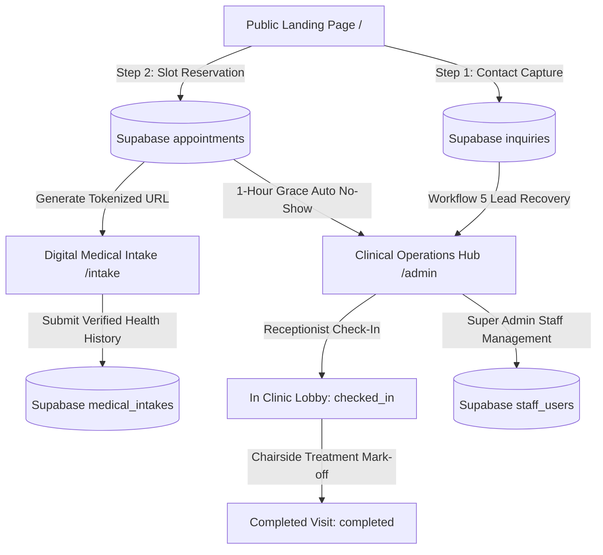

# Lumina Dental Studio — Complete System & Clinical Architecture Specification

**Product Edition:** Lumina Clinical Operations Hub & Patient Funnel v2.0  
**Target Environment:** Production Next.js 15 App Router + Supabase PostgreSQL  
**Primary Clinic Location:** Bonifacio Global City (BGC), Taguig, Metro Manila  
**Branch Locations:** Ortigas Center (Pasig City), Alabang Town Center (Muntinlupa City)  
**Live Production URL:** [https://luminadentalcarestudio.vercel.app](https://luminadentalcarestudio.vercel.app)

---

## Table of Contents
1. [System Architecture & Flow Overview](#1-system-architecture--flow-overview)
2. [Public Patient Funnel & Booking Engine (`/`)](#2-public-patient-funnel--booking-engine-)
3. [Digital Medical Intake & HMO Triage Engine (`/intake`)](#3-digital-medical-intake--hmo-triage-engine-intake)
4. [Clinical Operations & Doctor Portal (`/admin`)](#4-clinical-operations--doctor-portal-admin)
   - [Tab 1: Chairside Treatment & Daily Clinical Schedule](#tab-1-chairside-treatment--daily-clinical-schedule)
   - [Tab 2: Lumina Interactive Calendar & Holiday Hub](#tab-2-lumina-interactive-calendar--holiday-hub)
   - [Tab 3: Clinical Inquiries & Abandoned Lead Recovery](#tab-3-clinical-inquiries--abandoned-lead-recovery)
   - [Tab 4: Staff & Clinicians Access Directory](#tab-4-staff--clinicians-access-directory)
5. [Staff Account Security & Profile Settings (`/admin/account` & `/admin/login`)](#5-staff-account-security--profile-settings-adminaccount--adminlogin)
6. [Automated Triage & State Lifecycle](#6-automated-triage--state-lifecycle)
7. [Database Schema & Timestamp Lifecycle](#7-database-schema--timestamp-lifecycle)
8. [Automated Playwright E2E Test Suite & Test Accounts](#8-automated-playwright-e2e-test-suite--test-accounts)

---

## 1. System Architecture & Flow Overview



---

## 2. Public Patient Funnel & Booking Engine (`/`)

* **Hero & Clinical Aesthetics**: Tailored luxury typography, interactive micro-animations, treatment gallery with real high-resolution dental photography (Laser Teeth Whitening, Porcelain Veneers, Clear Aligners, Routine Hygiene).
* **Step 1 Lead Capture (Anti-Abandonment Gate)**:
  * Collects patient first name, last name, email address, mobile number, and service of interest.
  * Writes directly to the `inquiries` table with `source = 'booking_funnel_step1'`.
  * If the patient abandons before completing Step 2 slot reservation, **Workflow 5 (Abandoned Lead Recovery)** triggers personalized SMS/Email re-engagement.
* **Step 2 Calendar Slot Reservation**:
  * **Sunday Rest Day Disablement**: Sundays are strictly disabled and non-bookable (`closed`).
  * **Interactive Slot Picker**: Real-time morning and afternoon slots (10:00 AM to 5:00 PM).
  * **Duplicate Prevention**: Booked slots are cross-checked against Supabase and rendered disabled.
* **Emergency Hotlines & Contact Modal**:
  * Organic inquiries captured via contact modal write to `inquiries` with `source = 'contact_modal'`.

---

## 3. Digital Medical Intake & HMO Triage Engine (`/intake`)

* **Secure Tokenized Routing**: Access via unique intake token (`/intake?token=...`), ensuring patient privacy without requiring patient login passwords.
* **Clinical Health Questionnaire**:
  * Medical history (Hypertension, Diabetes, Bleeding disorders, Heart conditions).
  * Drug & Latex Allergy declarations (Penicillin, Local Anesthetics, Latex, Sulfa, Aspirin).
  * Current prescription medications.
  * Emergency contact person and contact number.
* **HMO Provider & Member ID Capture**: Supports Maxicare, Intellicare, Medicard, PhilCare, Etiqa, CareHealth Plus, and Private Pay.
* **Digital Signature & Legal Consent**: Canvas-based patient digital signature and acknowledgement of emergency medical disclosure.
* **Automatic Appointment Linkage**: Submissions write to `medical_intakes` and update `appointments.intake_completed_at`.

---

## 4. Clinical Operations & Doctor Portal (`/admin`)

### Tab 1: Chairside Treatment & Daily Clinical Schedule
* **Executive Header Banner**: Real-time patient intake, check-in status, clinical notes, and post-op care triage.
* **Date Segment Control**:
  * **Today** (Default): Displays visits scheduled for today (PST Manila date).
  * **This Week**: Filters visits occurring between Monday and Saturday of the active week.
  * **This Month**: Displays all visits for the active month.
  * **All**: Displays complete historical and upcoming schedule.
  * Styled with active Lumina Teal (`#0d9488`) segmented pills (no generic black buttons).
* **Multi-Attribute Real-Time Search**: Instant search filtering across **Patient Name**, **Email Address**, **Mobile Phone**, **Clinical Service**, **Doctor Notes**, **Medical Conditions**, and **Allergies**.
* **Card Structure**:
  * Removed initials avatar box for an open, executive multi-row card format matching the Inquiries tab.
  * **Top Badges**: Time slot, formatted date, visit status, intake verification pill (`✓ Verified Intake • HMO Provider` / `Intake Pending`), red allergy alert tag, and complication follow-up flag.
  * **Clinical Details**: Patient name, clinical service, quoted patient notes, and clickable contact links (`mailto:` / `tel:`).
* **4-Step Clinical Lifecycle Buttons**:
  1. **Date-Gated Check-In**:
     * *Today's Visits*: Active emerald **`[ Check In ]`** button marks patient arrived in lobby (`checked_in`).
     * *Future Visits*: Disabled button with scheduled date badge (`Check In (Aug 26, 2026)`). When clicked, displays inline alert: *"Patient check-in is only available on the scheduled date."*
  2. **Chairside Action Gate**: Doctor's **`[ Action ]` / `[ Complete Visit ]`** button appears **only after** patient has checked in.
  3. **Chairside Mark-Off Modal**: Select Standard Recovery vs Complication (dispatches care sequence vs staff follow-up alert), logs doctor notes, and records `completed_at`.
  4. **Outcome Editing**: Allows attending doctor to modify notes or follow-up flags via **`[ Edit Outcome ]`**.

### Tab 2: Lumina Interactive Calendar & Holiday Hub
* **Monthly Grid View**: 7-day grid showing all scheduled, checked-in, completed, and unattended visits.
* **Sunday Rest Day Handling**: Sundays are rendered in a subtle, disabled rest-day tone (`cursor-not-allowed`) without opening daily schedule modals.
* **Color-Coded Calendar Event Chips**:
  * **Completed**: Lumina Teal (`bg-teal-50 text-[#0f766e] border border-teal-200`)
  * **In Lobby (Checked In)**: Emerald (`bg-emerald-50 text-emerald-800 border border-emerald-300`)
  * **Confirmed / Intake Submitted**: Sky Blue (`bg-[#e0f2fe] text-[#0369a1]`)
  * **No Show (Unattended)**: Muted Rose / Slate (`bg-rose-50 text-rose-800 border border-rose-200`)
* **Philippine Public Holidays 2026**: Pre-loaded Philippine official holidays (Ninoy Aquino Day, National Heroes Day, Bonifacio Day, Christmas, Rizal Day) tagged on the calendar.
* **Daily Schedule Modal**: Clicking any operable day opens a focused modal with date-gated check-in and treatment completion actions.

### Tab 3: Clinical Inquiries & Abandoned Lead Recovery
* **Search & Filters**: Real-time search across patient name, email, phone, service of interest, and inquiry message. Filter by status (`All`, `New / Active Leads`, `Converted to Booking`, `Archived`) and source (`Contact Form Modal`, `Step 1 Funnel Drop-off`).
* **Lead Attribution Cards**:
  * Displays source badge (`Contact Form Inquiry` vs `Step 1 Funnel Drop-off`).
  * Quoted inbound message block.
  * Formatted sans-serif date/time stamp.
* **Automation State & Action Rules**:
  * **`CONVERTED` Leads**: Display permanent green success pill `[ ✓ Converted to Booking ]` + `⚡ Automation Completed • [Timestamp]`. **Archive button is hidden** because converted leads are active bookings.
  * **`NEW LEAD`**: Receptionist can click `[ Mark Converted ]` or `[ Archive ]`.
  * **`ARCHIVED`**: Option to click `[ Restore to Active ]`.

### Tab 4: Staff & Clinicians Access Directory
* **Live Supabase Sync**: Direct real-time sync with `staff_users` table with password hashing.
* **Responsive 3-Column Grid**: Executive cards displaying role badge (`Super Admin`, `Attending Doctor`, `Front Desk`), specialization, assigned clinic branch, and PRC dental license number.
* **9-Card Pagination**: Displays exactly 9 staff accounts per page. Pagination bar automatically triggers when staff accounts exceed 9, with Previous, numbered pills (`1`, `2`, ...), and Next buttons.
* **Access Revocation Modal**: Custom confirmation modal to revoke doctor/staff portal access without browser alert popups. Primary owner account is protected.

---

## 5. Staff Account Security & Profile Settings (`/admin/account` & `/admin/login`)

* **Staff Authentication Gate**: `/admin` and `/admin/account` strictly redirect unauthenticated sessions to `/admin/login`.
* **Clean Login Portal**: Email address and Practice Password inputs with explicit placeholders and clean Sign In button (quick role presets removed for enterprise security).
* **Live Inline Password Validation**: Real-time feedback under New Password and Confirm Password fields detecting length requirements and instant mismatch warnings.
* **Assigned Clinic Location Dropdown**:
  1. Bonifacio Global City, Taguig (Main Dental Studio)
  2. Ortigas Center, Pasig City (San Antonio Studio)
  3. Alabang Town Center, Muntinlupa City (South Hub)
* **Automatic Supabase Reflection**: Saves first name, last name, phone, branch location, specialization, and PRC license directly to `staff_users`.

---

## 6. Automated Triage & State Lifecycle

### 1-Hour Auto-Triage Grace Period
If an appointment's schedule has passed by 1 hour (e.g. `2:00 PM – 3:00 PM` slot and current Manila time is past `4:00 PM`) and the patient was never checked in:
* Background checker automatically patches Supabase `appointments.status = 'no_show'` and records `no_show_at`.
* Action and check-in buttons are removed and replaced with non-interactive `[ • Unattended ]` tag.

---

## 7. Database Schema & Timestamp Lifecycle

```sql
-- Appointments Lifecycle & Timestamp Migration
ALTER TYPE appointment_status ADD VALUE IF NOT EXISTS 'checked_in';

ALTER TABLE appointments
ADD COLUMN IF NOT EXISTS checked_in_at TIMESTAMPTZ,
ADD COLUMN IF NOT EXISTS completed_at TIMESTAMPTZ,
ADD COLUMN IF NOT EXISTS no_show_at TIMESTAMPTZ,
ADD COLUMN IF NOT EXISTS cancelled_at TIMESTAMPTZ;

CREATE INDEX IF NOT EXISTS idx_appointments_status_date ON appointments(status, appointment_date);
```

---

## 8. Automated Playwright E2E Test Suite & Test Accounts

The end-to-end testing suite is located in [`tests/e2e/admin-dashboard.spec.ts`](file:///Users/macbookpro/Downloads/Lumina-Dental-Studio-main/Lumina-UI/tests/e2e/admin-dashboard.spec.ts) and executes with 100% pass rate:

### Test Accounts Configured:
1. **Super Admin Account**:
   * Email: `bryantiversonmelliza03@gmail.com`
   * Password: `LuminaStudio2026!`
   * Permissions: Full system management, staff creation, removal, and account security.
2. **Attending Dentist Account**:
   * Email: `brybry.melliza@gmail.com`
   * Password: `LuminaMeow123`
   * Permissions: Chairside schedule, clinical intake viewing, and treatment mark-off (Staff Directory hidden).
3. **Dynamic Test User (Staff Lifecycle Testing)**:
   * Name: **Zenux Iverson Melliza**
   * Birthday: `2003-11-27`
   * Branch: `Bonifacio Global City, Taguig`
   * Specialization: `Cosmetic & Restorative Dentist`
   * License: `PRC-112703`
   * Email: `bryantmelliza03@gmail.com`
   * Password: `ZenuxSecurePass2026!`
   * Lifecycle: Created in Test 05 $\rightarrow$ verified in staff search $\rightarrow$ revoked and deleted from database cleanly.

### Running the Test Suite:
```bash
# Run against live production deployment:
PLAYWRIGHT_TEST_BASE_URL=https://luminadentalcarestudio.vercel.app npx playwright test tests/e2e/admin-dashboard.spec.ts

# Run against local development server:
npm run build
npm run start
npx playwright test tests/e2e/admin-dashboard.spec.ts
```
