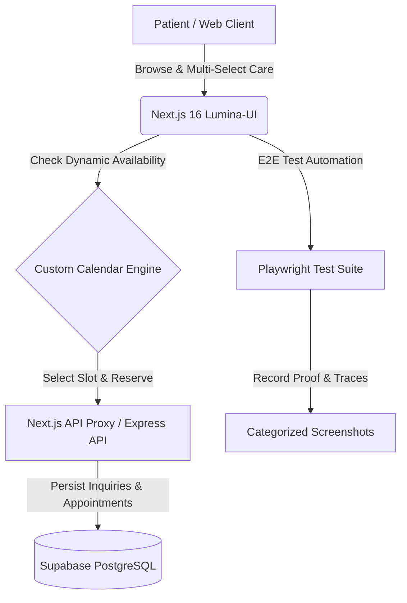

<div align="center">

# ✨ Lumina Dental Studio

### *Next-Generation Clinical Dental Platform & Automated Scheduling Monorepo*

[](https://nextjs.org/)
[](https://www.typescriptlang.org/)
[](https://tailwindcss.com/)
[](https://expressjs.com/)
[](https://supabase.com/)
[](https://playwright.dev/)

<p align="center">
  <b>A high-converting clinical dental web experience featuring an interactive multi-step appointment funnel, real-time calendar slot lockouts, clinical inquiry triage, and enterprise-grade end-to-end test automation.</b>
</p>

[Explore Features](#-key-features) • [Monorepo Architecture](#-monorepo-architecture) • [Getting Started](#-getting-started) • [API Reference](#-api-endpoints) • [E2E Testing](#-automated-testing-with-playwright)

---

</div>

## 🌟 Overview

**Lumina Dental Studio** bridges premium clinical dental care with modern digital health infrastructure. Built with Next.js 16 App Router, Express, Supabase PostgreSQL, and Playwright, the platform provides seamless booking, automated schedule lockout, medical intake charts, and instant concierge dispatch.

> [!NOTE]
> **Use Case & Automation Architecture**: This project serves as a production-grade showcase and foundational blueprint for **high-converting funnel landing websites with applied workflow automations** (such as n8n webhooks, transactional SMS/email dispatch, and real-time database locks). It is architected for continuous upgrades, CRM integrations, and automated patient journey expansions.

<br />



---

## 🎯 Key Features

<table>
  <tr>
    <td width="50%">
      <h3>🗓️ 3-Step Interactive Booking Funnel</h3>
      <ul>
        <li><b>Step 1: Patient Health Profile</b> — Instant validation, custom Date of Birth calendar modal (with quick-year navigation), and clinical sex assignment.</li>
        <li><b>Step 2: Multi-Select Treatment Catalog</b> — Choose single or multiple treatments across Preventive, Cosmetic, and Surgical care with real-time counter pills.</li>
        <li><b>Step 3: Real-Time Availability</b> — Interactive date picker automatically disables fully booked days (soft red indicator + hover tooltips) and locks occupied time slots.</li>
        <li><b>Step 4: Confirmation Screen</b> — Clean summary with one-click reset for multiple appointments.</li>
      </ul>
    </td>
    <td width="50%">
      <h3>💬 Clinical Inquiry & Triage</h3>
      <ul>
        <li><b>Direct Concierge Dispatch</b> — Inquire about insurance benefits, treatment plans, and pricing estimates.</li>
        <li><b>Automated DB Persistence</b> — All inquiries securely stored in Supabase with timestamps and treatment metadata.</li>
        <li><b>Official Studio Channel</b> — Direct dispatch configured for <code>luminadentalclinic2026@gmail.com</code>.</li>
        <li><b>Emergency Triage Modal</b> — Rapid-access modal for acute dental emergencies and same-day priority booking.</li>
      </ul>
    </td>
  </tr>
  <tr>
    <td width="50%">
      <h3>🔍 Enterprise SEO & Rich Snippets</h3>
      <ul>
        <li><b>Schema.org Dentist JSON-LD</b> — Structured clinic data embedded in <code>layout.tsx</code> for Google Search rich cards.</li>
        <li><b>Dynamic Sitemap & Robots</b> — Automated <code>sitemap.xml</code> and <code>robots.txt</code> endpoints.</li>
        <li><b>OpenGraph & Twitter Cards</b> — High-resolution preview metadata for social sharing.</li>
      </ul>
    </td>
    <td width="50%">
      <h3>🛡️ HIPAA & Digital Standards</h3>
      <ul>
        <li><b>WCAG 2.1 AA Accessibility</b> — High-contrast typography, full screen-reader ARIA labeling, and keyboard focus states.</li>
        <li><b>HIPAA Privacy Notices</b> — Dedicated legal modules covering PHI security, data retention, and patient consent.</li>
        <li><b>Secure API Proxy</b> — Protects database service-role secrets from client-side exposure.</li>
      </ul>
    </td>
  </tr>
</table>

---

## 📁 Monorepo Architecture

```text
Lumina-Dental-Studio/
├── 📁 Lumina-UI/                  # Next.js 16 App Router Client
│   ├── src/
│   │   ├── app/
│   │   │   ├── api/              # Internal Next.js API route handlers
│   │   │   ├── layout.tsx        # Global layout, Google Fonts, JSON-LD Schema
│   │   │   ├── page.tsx          # Studio funnel, calendar, treatment cards, modals
│   │   │   ├── sitemap.ts        # Dynamic XML sitemap generator
│   │   │   └── robots.ts         # Automated search engine crawler instructions
│   │   └── components/           # UI design system components
│   ├── tests/
│   │   ├── e2e/                  # Playwright end-to-end test suites
│   │   │   ├── booking-funnel.spec.ts
│   │   │   ├── inquiry-form.spec.ts
│   │   │   └── helpers.ts
│   │   └── screenshots/          # Categorized test run captures (.gitignored)
│   │       ├── booking/
│   │       └── inquiry/
│   ├── playwright.config.ts      # Multi-browser E2E testing configuration
│   └── package.json
│
├── 📁 Lumina-API/                 # Express + TypeScript Backend REST Service
│   ├── src/                      # Route controllers & Supabase client bindings
│   ├── schema.sql                # Production SQL schema & table definitions
│   └── package.json
│
├── .gitignore                    # Monorepo git rules (builds, .env, screenshots)
└── README.md                     # Monorepo documentation
```

---

## ⚡ Getting Started

### 1. Prerequisites
- **Node.js**: `v18.0.0` or higher
- **Package Manager**: `npm`, `pnpm`, or `yarn`
- **Database**: Free or Pro [Supabase](https://supabase.com) Project

---

### 2. Frontend Setup (`Lumina-UI`)

```bash
# Navigate to the frontend directory
cd Lumina-UI

# Install dependencies
npm install

# Start development server
npm run dev
```

Open [http://localhost:3000](http://localhost:3000) (or `http://localhost:3001`) in your browser.

---

### 3. Backend Setup (`Lumina-API`)

```bash
# Navigate to the API directory
cd Lumina-API

# Install dependencies
npm install

# Configure environment variables
# Create a .env file:
# SUPABASE_URL=https://your-project.supabase.co
# SUPABASE_SERVICE_ROLE_KEY=your_service_role_key
# PORT=5001

# Start development server
npm run dev
```

---

## 🗄️ Database Schema Setup (Supabase)

Copy and execute [`Lumina-API/schema.sql`](Lumina-API/schema.sql) in your **Supabase SQL Editor**:

```sql
-- 1. General & Clinical Inquiries
CREATE TABLE IF NOT EXISTS inquiries (
  id UUID PRIMARY KEY DEFAULT gen_random_uuid(),
  first_name TEXT NOT NULL,
  last_name TEXT NOT NULL,
  email TEXT NOT NULL,
  phone TEXT,
  service TEXT,
  message TEXT NOT NULL,
  created_at TIMESTAMPTZ DEFAULT NOW()
);

-- 2. Patient Directory
CREATE TABLE IF NOT EXISTS patients (
  id UUID PRIMARY KEY DEFAULT gen_random_uuid(),
  first_name TEXT NOT NULL,
  last_name TEXT NOT NULL,
  email TEXT UNIQUE NOT NULL,
  mobile TEXT NOT NULL,
  dob DATE NOT NULL,
  sex TEXT NOT NULL,
  created_at TIMESTAMPTZ DEFAULT NOW()
);

-- 3. Confirmed Appointments
CREATE TABLE IF NOT EXISTS appointments (
  id UUID PRIMARY KEY DEFAULT gen_random_uuid(),
  patient_id UUID REFERENCES patients(id) ON DELETE CASCADE,
  service TEXT NOT NULL,
  appointment_date TEXT NOT NULL,
  appointment_time TEXT NOT NULL,
  notes TEXT,
  status TEXT DEFAULT 'reserved',
  created_at TIMESTAMPTZ DEFAULT NOW()
);
```

---

## 🔌 API Endpoints

| Method | Endpoint | Description | Payload |
| :--- | :--- | :--- | :--- |
| `POST` | `/api/inquiries` | Submit clinical / pricing inquiry | `{ firstName, lastName, email, phone?, service?, message }` |
| `POST` | `/api/appointments` | Book appointment reservation | `{ firstName, lastName, email, mobile, dob, sex, service, date, time, notes? }` |
| `GET` | `/api/intake` | Fetch pre-visit intake form by token | `?token=...` |
| `POST` | `/api/intake` | Submit medical history & allergies | `{ appointmentId, medicalConditions, allergies, medications }` |
| `GET` | `/api/health` | Service health status check | *None* |

---

## 🧪 Automated Testing with Playwright

Comprehensive end-to-end test suites validate form input constraints, multi-select procedures, calendar day lockouts, booked time slot badges, and database persistence.

```bash
cd Lumina-UI

# Run all E2E tests headlessly in terminal
npm run test:e2e

# Run with interactive visual UI (Time-Travel Debugger)
npm run test:e2e:ui

# View full HTML test report
npm run test:e2e:report
```

### 📸 Categorized Screenshot Architecture
Screenshots are automatically captured and organized into dedicated subfolders:
```text
tests/screenshots/
├── 📁 booking/
│   └── 📁 booking-aug22-3:58AM/
│       ├── 01-booking-step1-validation-errors.png
│       ├── 02-booking-locked-slots-demonstration.png
│       ├── 03-booking-step1-filled.png
│       ├── 04-booking-step2-multi-treatment-selected.png
│       ├── 05-booking-step3-slot-selected.png
│       └── 06-booking-step4-confirmed-success.png
│
└── 📁 inquiry/
    └── 📁 inquiry-aug22-3:58AM/
        ├── 01-inquiry-validation-errors.png
        ├── 02-inquiry-form-filled.png
        └── 03-inquiry-confirmed-success.png
```

---

## 📬 Contact & Inquiries

<div align="center">

**Lumina Dental Studio**  
📍 *Modern Clinical Dentistry & Aesthetics*  
📧 **Email**: [luminadentalclinic2026@gmail.com](mailto:luminadentalclinic2026@gmail.com)  
📞 **Phone**: (415) 555-0142  
🌐 **Website**: [https://www.luminadentalstudio.com](https://www.luminadentalstudio.com)

<br />

<sub>© 2026 Lumina Dental Studio, LLC. All rights reserved.</sub>

</div>
